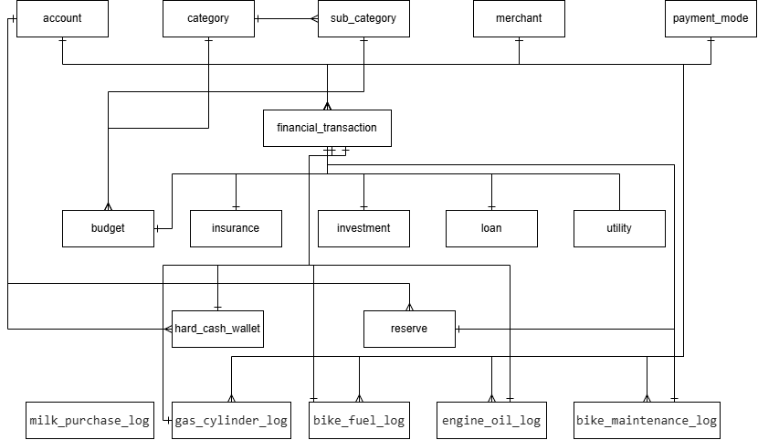

# Entity Relationship Diagram

---

## Document Information

| Property | Details |
|----------|---------|
| Project Name | Personal Finance Management System (PFMS) |
| Document Name | 05_Entity_Relationship_Diagram |
| Document ID | DOC-005 |
| Document Version | 1.0 |
| Document Status | Approved |
| Author | SaiAnjaneyaVinayKumar Parnandi |
| Created On | 04-Aug-2026 |
| Last Updated | 04-Aug-2026 |
| Reviewed By | SaiAnjaneyaVinayKumar Parnandi |
| Approved By | SaiAnjaneyaVinayKumar Parnandi |

---

## Purpose

The purpose of this Entity Relationship Diagram (ERD) document is to define and illustrate the relationships between the database entities of the Personal Finance Management System (PFMS).

This document provides a graphical representation of the physical database entities and their relationships as implemented in the approved Database Design Document (DDD). It serves as a visual reference for understanding entity associations, referential integrity, and database structure, thereby supporting database implementation, application development, testing, maintenance, and future enhancements.

---

## Scope

This Entity Relationship Diagram (ERD) document defines the complete set of database entities and their relationships implemented within the PostgreSQL database for the Personal Finance Management System (PFMS).

The ERD is derived from the approved Data Dictionary and Database Design Document and reflects the finalized physical database design.

The scope of this document includes, but is not limited to, the following:

- Master Tables
- Financial Planning Tables
- Reserve Planning Tables
- Operational Activity Log Tables
- Core Financial Transaction Tables
- Entity Relationships
- Cardinality
- Referential Integrity

This document does not define detailed database implementation specifications such as column definitions, data types, constraints, indexes, triggers, views, functions, or procedures. Those implementation details are documented separately within the Database Design Document (DDD).

---

## Entity Classification

The Personal Finance Management System (PFMS) database is organized into logical groups of entities based on their business responsibilities and functional purpose.

The Entity Relationship Diagram follows the same logical classification defined in the approved Database Design Document to improve readability, simplify database navigation, and clearly illustrate the relationships between business entities.

The following entity groups are implemented within the PostgreSQL database.

| S.No | Entity Group | Number of Entities | Description |
|------|--------------|-------------------:|-------------|
| 1 | Master Tables | 5 | Maintain reusable business reference information shared across multiple business modules. |
| 2 | Financial Planning Tables | 5 | Maintain budgeting, insurance, investment, loan, and utility planning information. |
| 3 | Reserve Planning Tables | 1 | Maintain Reserve Planning information and Reserve Cycle management. |
| 4 | Operational Activity Log Tables | 5 | Maintain historical records of operational activities associated with personal finance management. |
| 5 | Core Financial Transaction Tables | 2 | Maintain the centralized financial ledger and physical cash transaction information for the Personal Finance Management System (PFMS). |

The following sections summarize the relationships between these entities and illustrate their implementation through the Entity Relationship Diagram.

---

## Relationship Summary

The Personal Finance Management System (PFMS) database implements relationships between entities using Primary Key and Foreign Key constraints to preserve referential integrity and maintain a fully normalized relational database structure.

The relationships defined within the Entity Relationship Diagram represent the physical implementation of the approved Data Dictionary and Database Design Document.

The following table summarizes the relationships implemented within the PostgreSQL database.

| S.No | Parent Entity | Child Entity | Relationship | Description |
|------|---------------|--------------|--------------|-------------|
| 1 | `category` | `sub_category` | One-to-Many (1:N) | A Category can contain multiple SubCategories. |
| 2 | `category` | `budget` | One-to-Many (1:N) | A Category can be referenced by multiple Budget records. |
| 3 | `sub_category` | `budget` | One-to-Many (1:N) | A SubCategory can be referenced by multiple Budget records. |
| 4 | `account` | `financial_transaction` | One-to-Many (1:N) | An Account can have multiple Financial Transactions. |
| 5 | `category` | `financial_transaction` | One-to-Many (1:N) | A Category can be referenced by multiple Financial Transactions. |
| 6 | `sub_category` | `financial_transaction` | One-to-Many (1:N) | A SubCategory can be referenced by multiple Financial Transactions. |
| 7 | `payment_mode` | `financial_transaction` | One-to-Many (1:N) | A Payment Mode can be referenced by multiple Financial Transactions. |
| 8 | `merchant` | `financial_transaction` | One-to-Many (1:N) | A Merchant can be referenced by multiple Financial Transactions. |
| 9 | `merchant` | `insurance` | One-to-Many (1:N) | A Merchant can provide multiple Insurance policies. |
| 10 | `financial_transaction` | `insurance` | One-to-One (1:1) | Each Insurance record may reference its latest Financial Transaction. |
| 11 | `merchant` | `investment` | One-to-Many (1:N) | A Merchant can manage multiple Investments. |
| 12 | `account` | `investment` | One-to-Many (1:N) | An Account can fund multiple Investments. |
| 13 | `financial_transaction` | `investment` | One-to-One (1:1) | Each Investment record may reference its latest Financial Transaction. |
| 14 | `merchant` | `loan` | One-to-Many (1:N) | A Merchant can provide multiple Loans. |
| 15 | `account` | `loan` | One-to-Many (1:N) | An Account can be associated with multiple Loans. |
| 16 | `financial_transaction` | `loan` | One-to-One (1:1) | Each Loan record may reference its latest Financial Transaction. |
| 17 | `merchant` | `utility` | One-to-Many (1:N) | A Merchant can provide multiple Utility services. |
| 18 | `financial_transaction` | `utility` | One-to-One (1:1) | Each Utility record may reference its latest Financial Transaction. |
| 19 | `account` | `reserve` | One-to-Many (1:N) | An Account can contain multiple Reserve records. |
| 20 | `financial_transaction` | `reserve` | One-to-One (1:1) | Each Reserve record may reference its associated Financial Transaction. |
| 21 | `account` | `hard_cash_wallet` | One-to-Many (1:N) | An Account can have multiple Hard Cash Wallet records. |
| 22 | `category` | `hard_cash_wallet` | One-to-Many (1:N) | A Category can classify multiple Hard Cash Wallet records. |
| 23 | `sub_category` | `hard_cash_wallet` | One-to-Many (1:N) | A SubCategory can classify multiple Hard Cash Wallet records. |
| 24 | `merchant` | `hard_cash_wallet` | One-to-Many (1:N) | A Merchant can be associated with multiple Hard Cash Wallet records. |
| 25 | `financial_transaction` | `hard_cash_wallet` | One-to-One (1:1) | Each Hard Cash Wallet record references its associated Financial Transaction. |
| 26 | `merchant` | `bike_fuel_log` | One-to-Many (1:N) | A Merchant can be associated with multiple Bike Fuel records. |
| 27 | `merchant` | `engine_oil_log` | One-to-Many (1:N) | A Merchant can be associated with multiple Engine Oil records. |
| 28 | `merchant` | `bike_maintenance_log` | One-to-Many (1:N) | A Merchant can be associated with multiple Bike Maintenance records. |

The relationships summarized above are illustrated in the Entity Relationship Diagram presented in the following sections.

---

## Cardinality Summary

The Personal Finance Management System (PFMS) database uses standard relational cardinalities to model business relationships between entities. These cardinalities define how records in one entity are associated with records in another while maintaining referential integrity.

The following cardinalities are implemented within the PostgreSQL database.

| Cardinality | Description | Usage within PFMS |
|-------------|-------------|-------------------|
| One-to-One (1:1) | A single record in one entity is associated with exactly one record in another entity. | Used between `financial_transaction` and business-specific entities such as `insurance`, `investment`, `loan`, `utility`, `reserve`, and `hard_cash_wallet`. |
| One-to-Many (1:N) | A single record in the parent entity can be associated with multiple records in the child entity. | Used extensively between Master Tables and business entities to support reusable reference data and maintain normalization. |

The Entity Relationship Diagram uses these cardinalities to illustrate the relationships between entities while preserving referential integrity and supporting the normalized relational database design adopted for the Personal Finance Management System (PFMS).

## Entity Relationship Diagram

The following Entity Relationship Diagram illustrates the physical database structure of the Personal Finance Management System (PFMS).

**Source Diagram**

`Assets/Diagrams/ERD/Personal_Finance_Management_System_ERD.drawio`

---

## Design Considerations

The Entity Relationship Diagram (ERD) has been designed to represent the physical database relationships implemented within the Personal Finance Management System (PFMS). The design adheres to standard relational database principles to ensure data consistency, integrity, scalability, and maintainability.

The following design considerations were adopted while developing the database model:

### Normalized Database Design

The database follows a normalized relational design to minimize data redundancy and maintain data consistency. Master tables store reusable reference data, while transactional and operational tables store business-specific information.

### Centralized Financial Transaction Model

The `financial_transaction` table serves as the centralized financial ledger of the system. Business modules such as Insurance, Investment, Loan, Utility, Reserve, and Hard Cash Wallet are associated with financial transactions through well-defined relationships, providing a single source of truth for all financial activities.

### Master Data Management

Reusable business entities including Account, Category, Sub Category, Merchant, and Payment Mode are maintained as Master Tables to promote consistency and reduce duplication across business modules.

### Modular Database Architecture

The database has been organized into logical modules including Master Tables, Financial Planning Tables, Core Financial Transaction Tables, Reserve Planning Tables, and Operational Activity Log Tables. This modular approach improves readability, maintainability, and future extensibility.

### Referential Integrity

Relationships between entities are enforced using Primary Key and Foreign Key constraints wherever applicable. The ERD illustrates these physical relationships to ensure data integrity across the database.

### Future Scalability

The database architecture has been designed to accommodate future business modules, additional operational logs, reporting requirements, and system enhancements with minimal structural changes.

---

## Document Summary

This document presents the Entity Relationship Diagram (ERD) for the Personal Finance Management System (PFMS), providing a graphical representation of the database entities and their relationships.

The ERD has been derived from the approved Data Dictionary and Database Design Document and reflects the finalized physical database design implemented in PostgreSQL.

The document serves as a reference for database implementation, backend development, system integration, testing, maintenance, and future enhancements. It complements the Data Dictionary and Database Design Document by illustrating the relationships between entities while maintaining consistency across the overall system documentation.

The Entity Relationship Diagram shall be updated whenever modifications are made to the approved database schema to ensure synchronization with the latest database design.
